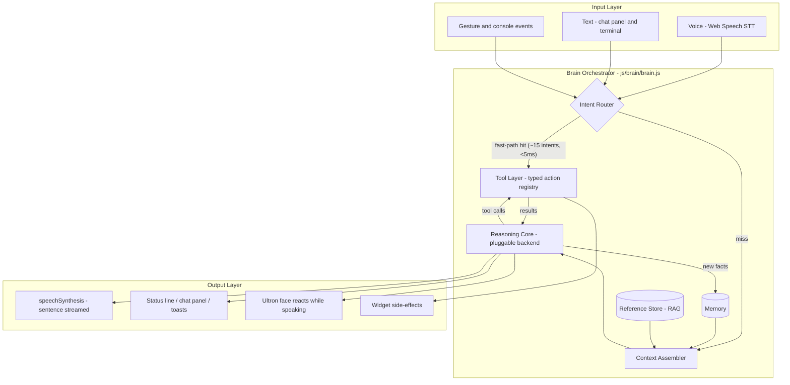
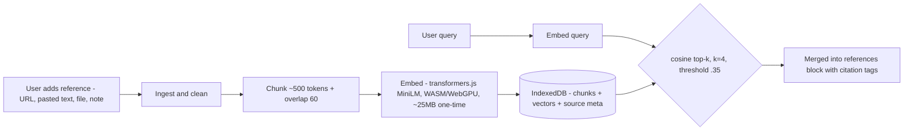

# J.A.R.V.I.S. Brain — Architecture

> Design doc v1 · authors: Pratik (AI engineer) + Claude · status: **for review**
> Scope: turn the dashboard's regex voice bot into a real assistant — LLM reasoning,
> tool-calling into every widget, memory, and a reference store (RAG) merged into
> its context. Constraint set: static GitHub Pages site, no server we own,
> privacy-first, must degrade gracefully to today's behavior with zero setup.

---

## 1. Goals & non-goals

**Goals**
- G1 — Natural language in (voice or text), grounded answers out: the brain always
  knows *today's* tasks, workout, steps, events, markets, weather, location.
- G2 — Action, not just chat: "add protein shake to tasks and show my calendar"
  executes two real operations against widget state.
- G3 — References merged into the brain: user drops URLs / notes / documents into
  Jarvis's memory; answers cite and use them (browser-side RAG).
- G4 — Pluggable intelligence: same brain runs on (a) a hosted LLM API with the
  user's key, (b) a fully-local in-browser model, or (c) the existing rules —
  selected at runtime, hot-fallback down the chain.
- G5 — Zero-setup baseline: with no key and no model download, everything the
  dashboard does today keeps working (rules backend).

**Non-goals (v1)**
- No server-side components, accounts, or telemetry.
- No always-on wake-word listening (privacy + battery); push-to-talk stays.
- No multi-user support.

---

## 2. System overview



The **orchestrator** (`js/brain/brain.js`) owns one public API:

```ts
brain.ask(input: string, opts?: { source: 'voice'|'text'|'gesture' })
  → AsyncIterable<BrainEvent>
// BrainEvent = {type:'token', text} | {type:'tool', name, args, result}
//            | {type:'done', text, citations?} | {type:'error', fallback}
```

Everything else (voice.js, the chat panel, the terminal page) is a thin client of
`brain.ask()`. Streaming is first-class so TTS can start speaking sentence one
while sentence two is still generating.

---

## 3. Intent Router — the hybrid fast path

Today's regex grammar in `voice.js` doesn't die; it becomes **tier 0**:

| Tier | Engine | Latency | Handles |
|---|---|---|---|
| 0 | Deterministic grammar (ported from voice.js) | <5 ms | ~15 frozen commands: "open calendar", "add task X", "what time is it", "gestures on"… |
| 1 | LLM with tools (backend chain, §6) | 0.6–3 s | everything else: compound commands, questions, chit-chat, reference lookups |

Rules:
- Tier 0 matches must be **unambiguous prefixes** (exact verb + known noun). On
  match → execute directly, no LLM call, no context assembly. This keeps the
  10 most common interactions instant and free.
- Anything with a conjunction, a pronoun, a question word outside the frozen set,
  or >6 tokens routes to tier 1.
- If tier 1 is unavailable (no key, no model, offline) the router answers from
  tier 0 or returns the honest "I can't reason about that yet — add a key or
  load the local model in Settings."

---

## 4. Context Assembler — how references get merged

The prompt is assembled fresh per request from four sections, each with a hard
token budget (total ≤ ~2.2k tokens before the user turn):

```
┌──────────────────────────────────────────────────────────┐
│ SYSTEM: persona + tool schemas            (~500 tok)     │
│ <live_state>   widget snapshots           (~700 tok)     │
│ <memory>       facts + rolling summary    (~400 tok)     │
│ <references>   top-k retrieved chunks     (~600 tok)     │
│ chat history (last 8 turns, oldest trimmed first)        │
│ USER: the utterance                                      │
└──────────────────────────────────────────────────────────┘
```

**`<live_state>` — the widget contract.** Every widget already implements
`{id, mount, refresh…}`; we add one optional method:

```ts
getContext(): { summary: string; data?: object; freshness: number }
// e.g. tasks → "3 open tasks today: gym, protein order, SOC report review"
// markets → "NIFTY 24,975 (+0.02%) · BTC $118,250 · portfolio tab: IN"
```

The assembler calls all providers, sorts by relevance to the utterance (cheap
keyword overlap first; embedding similarity when the vector model is loaded),
and packs summaries until the budget is full. Freshness timestamps let the model
say "as of 2 minutes ago". Nothing is sent anywhere until the moment of a
request, and only to the backend the user chose.

**`<references>` — the RAG pipeline (G3).** New Reference Store subsystem:



- **Ingest paths**: paste text/notes (always works) · file drop (.md/.txt) ·
  URL fetch — direct `fetch` when the site sends CORS headers, else via a
  user-enabled read-proxy option (documented trade-off; off by default).
- **Fallback retrieval** when the embedding model isn't downloaded: BM25-lite
  keyword scoring over the same chunks — worse recall, zero download.
- **Citations**: retrieved chunks carry `[ref:3]` tags; the persona instructs the
  model to cite, and the chat panel renders them as links to the source.
- **Security invariant**: reference content is *data, never instructions*. The
  assembler wraps it in a fenced untrusted block, and the tool layer refuses any
  destructive tool call whose only provenance is retrieved text (§7).

---

## 5. Memory

Three stores, all local (`localStorage` / IndexedDB), all user-inspectable in a
Memory panel:

| Store | Contents | Write path | Eviction |
|---|---|---|---|
| Conversation buffer | last 12 turns verbatim | automatic | sliding window |
| Rolling summary | 1-paragraph compressed history | model-generated when buffer overflows | rewritten in place |
| Fact store (`jarvis.v1.memory`) | "user prefers evening workouts", "sister's name is X" | explicit "remember that…" always; model-proposed facts require one-tap approval | pin/decay: unpinned facts expire after 60 unused days |

Design choice to argue about: model-proposed memories are **opt-in per fact**
(a small "remember this?" chip after the answer). Silent memory writes are how
assistants get creepy; an AI engineer's dashboard should show its writes.

---

## 6. Reasoning Core — pluggable backends

```ts
interface BrainBackend {
  id: 'api' | 'webllm' | 'rules';
  available(): Promise<boolean>;          // key present? WebGPU? model cached?
  complete(req: {
    system: string; messages: Msg[]; tools: ToolSchema[];
    stream: (ev: BrainEvent) => void;
  }): Promise<Completion>;                // text and/or toolCalls
}
```

| Backend | Model | Tool calling | Cold start | Cost | Privacy |
|---|---|---|---|---|---|
| **api** | Claude Haiku 4.5 (default) or any OpenAI-compatible endpoint, key from Settings | native | ~0.6 s | pennies | utterance + context leaves device |
| **webllm** | Llama-3.2-3B-Instruct q4 via WebLLM/WebGPU | JSON-schema constrained decoding + retry-on-parse-fail | 1–2 GB one-time download, then ~2 s load | free | 100% local |
| **rules** | the tier-0 grammar | n/a (direct execution) | 0 | free | 100% local |

- **Selection**: Settings → Brain: `Auto | API | Local | Rules`. Auto = api if
  key present → webllm if model cached + WebGPU → rules.
- **Fallback chain at runtime**: api 401/429/network → webllm → rules, with a
  visible badge on the answer saying which brain produced it (same honesty
  pattern as the LIVE/PROXY/DEMO data badges).
- **Streaming contract**: both api (SSE) and webllm (token callback) emit
  `{type:'token'}` events; rules emits one `done`.

---

## 7. Tool Layer — how the brain acts

Typed registry; each widget contributes actions at registration:

```ts
interface ToolDef {
  name: string;                  // "add_task"
  description: string;           // for the model
  schema: JSONSchema;            // args, validated before execute
  execute(args): Promise<{ ok: boolean; summary: string; data?: object }>;
  danger?: 'none' | 'confirm';   // confirm → user must tap before execution
}
```

Initial surface (v1): `add_task · complete_task · list_tasks · add_event ·
query_calendar · get_workout · log_steps · log_pulse · get_quote · get_news ·
get_weather · open_widget · fly_to(lat,lon|place) · set_theme_accent ·
gestures(on|off)`. Destructive ops (`reset_all`, `delete_event`) are
`danger:'confirm'`.

**Agent loop**: `complete → toolCalls? → execute (parallel-safe ones in
parallel) → append results → complete again`, max **3 rounds**, then forced
answer. Every executed tool emits a `{type:'tool'}` event so the UI can show
"⚙ added task · opened calendar" receipts under the reply.

**Security invariants**
1. The model can only call registered names with schema-valid args — no eval,
   no DOM access, no fetch primitive exposed.
2. `danger:'confirm'` tools render a native confirm chip; voice can't bypass it.
3. Tool calls are refused when the current turn's user input is empty and the
   only novel content is retrieved reference text (prompt-injection gate, §4).

---

## 8. Output Layer

- **TTS**: sentence-buffered streaming — speak sentence *n* while *n+1*
  generates. Barge-in: any new user input cancels speech.
- **Face**: `reactorApi` gains `speak(amplitude)` — Ultron's eyes/mouth glow
  modulates with an amplitude envelope synthesized from TTS boundary events
  (the Web Speech API exposes word boundaries; we low-pass them into a mouth
  signal). The head turns slightly toward the camera while speaking.
- **Chat surface**: a `jarvis` widget (9th tile): message list, tool receipts,
  citations, brain badge, mic button — the same `brain.ask()` stream the voice
  path uses. The command.html terminal also swaps its mock `respond()` for
  `brain.ask()`.

---

## 9. Module map & loading strategy

```
docs/js/brain/
├── brain.js        orchestrator: ask(), event fan-out, fallback chain   (~150 loc)
├── router.js       tier-0 grammar (ported from voice.js) + routing      (~120 loc)
├── context.js      ContextProvider registry, budgeter, packer           (~150 loc)
├── tools.js        ToolDef registry, validator, agent loop, confirm UI  (~180 loc)
├── memory.js       buffer + summary + fact store + approval chips      (~150 loc)
├── refs.js         Reference Store: ingest, chunk, embed, retrieve      (~220 loc)
└── backends/
    ├── api.js      OpenAI-compatible + Anthropic fetch, SSE streaming   (~140 loc)
    ├── webllm.js   lazy import of @mlc-ai/web-llm, schema-forced tools  (~160 loc)
    └── rules.js    wraps router grammar as a backend                    (~40 loc)
```

- Everything lazy: `brain/` loads on first interaction; `webllm.js` imports the
  1.5 MB runtime only when the user picks Local; the embedding model downloads
  only when the first reference is added.
- No build step preserved: all deps via pinned CDN ESM imports (WebLLM and
  transformers.js both ship browser ESM bundles).
- voice.js shrinks to: STT capture → `brain.ask()` → TTS of events.

---

## 10. Latency budget (P50 targets)

| Path | Target |
|---|---|
| Tier-0 command ("open calendar") | < 50 ms end-to-end |
| API answer, first spoken word | < 1.5 s |
| API answer with 2 tool rounds | < 4 s |
| WebLLM (3B, warm) first token | < 1.2 s · ~15–25 tok/s after |
| Reference retrieval (1k chunks) | < 30 ms |
| Embedding model cold download | one-time ~25 MB, background |

---

## 11. Failure & degradation matrix

| Condition | Behavior |
|---|---|
| No API key, no local model | tier-0 only + honest capability message |
| API 401/429/offline | auto-fallback webllm → rules, badge shows downgrade |
| WebGPU absent | Local option greyed out in Settings with reason |
| Embeddings not downloaded | keyword retrieval, references still usable |
| STT unsupported (Firefox/iOS quirks) | chat panel text input is the primary path |
| Storage quota | refs evict LRU-by-source with user warning; facts never auto-evicted if pinned |

---

## 12. Privacy posture (unchanged ethos)

Camera frames, audio, tasks, health data: never leave the device except the
single assembled prompt sent to the API **the user configured**, only while a
request is in flight. The Settings panel shows exactly what a prompt contains
(a "show last prompt" debug view — good engineering hygiene and great trust UX).
Keys stay client-side in localStorage, free-tier guidance documented as today.

---

## 13. Design-reference pipeline (the *other* kind of references)

Separate concern, tiny process, kept out of the brain: when you share reference
sites/screenshots, we (1) extract a motion+type spec (durations, easings, type
scale, spacing) into `docs/DESIGN-NOTES.md`, (2) encode it as tokens in
`premium.css`, (3) A/B screenshot against the reference. That doc grows into our
house style guide; the brain can *read* it as a reference like any other (§4),
so "Jarvis, why does this easing feel wrong?" is answerable.

---

## 14. Build phases (each lands green, shippable)

| Phase | Deliverable | Risk |
|---|---|---|
| **P0** | `brain/` skeleton: orchestrator + router + rules backend + ContextProvider on all 9 widgets; voice.js becomes a client. Pure refactor, zero new capability, all suites stay green. | low |
| **P1** | `api` backend + tool layer + chat widget + streaming TTS + brain badges. **The "it's alive" moment.** | medium — key UX |
| **P2** | Memory (buffer/summary/facts + approval chips + Memory panel) | low |
| **P3** | Reference Store + embeddings RAG + citations | medium — model download UX |
| **P4** | WebLLM local backend + Auto selection + degradation matrix tests | high — WebGPU variance |
| **P5** | Face-speech coupling, barge-in, command.html terminal on the real brain | low |

**Testing per phase**: unit (router grammar table, budgeter packing, tool
validator, retrieval ranking on synthetic corpora — same style as
`tests/gesture-core.test.mjs`) + headless integration with a **mock backend**
injected (deterministic completions/tool-calls), so CI never needs a real key.

---

## 15. Open questions for Pratik

1. **Default API**: Anthropic (Haiku 4.5) as the default `api` backend with an
   OpenAI-compatible escape hatch — agree?
2. **WebLLM model pick**: Llama-3.2-3B-Instruct vs Phi-3.5-mini vs Qwen2.5-3B —
   preference? (Tool-call reliability differs; I lean Llama 3.2 3B.)
3. **Memory approval UX**: per-fact chips (my proposal) vs trust-mode toggle?
4. **Read-proxy for URL ingestion**: ship the optional proxy toggle, or
   paste-only in P3?
5. Anything you want promoted from non-goal to goal (wake word? multi-device
   sync via your Supabase connector — pairs naturally with P2 memory)?
